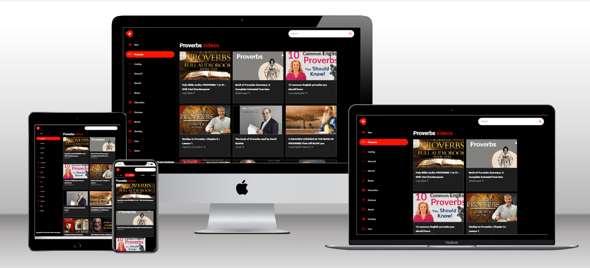

<a name="readme-top">My Videos</a>

<div align="center">
  
  <br/>

  <h3><b>My Videos</b></h3>

</div>

<!-- TABLE OF CONTENTS -->

# 📗 Table of Contents

- [📗 Table of Contents](#-table-of-contents)
- [📖 My Videos ](#-my-videos-)
  - [🛠 Built With ](#-built-with-)
    - [Tech Stack ](#tech-stack-)
    - [Key Features ](#key-features-)
  - [🚀 Live Demo ](#-live-demo-)
  - [💻 Getting Started ](#-getting-started-)
    - [Prerequisites](#prerequisites)
    - [Setup](#setup)
    - [Install](#install)
    - [Usage](#usage)
    - [Run tests](#run-tests)
    - [Deployment ](#deployment-)
  - [👥 Author ](#-author-)
  - [🔭 Future Features ](#-future-features-)
  - [🤝 Contributing ](#-contributing-)
  - [⭐️ Show your support ](#️-show-your-support-)
  - [🙏 Acknowledgments ](#-acknowledgments-)
  - [❓ FAQ (OPTIONAL) ](#-faq-optional-)
  - [📝 License ](#-license-)

<!-- PROJECT DESCRIPTION -->

# 📖 My Videos <a name="about-project"></a>

**My Videos** is a responsive React.js application with video sections, custom categories, channel pages, and can play videos directly from this app.

## 🛠 Built With <a name="built-with"></a>

### Tech Stack <a name="tech-stack"></a>

<details>
  <summary>Client</summary>
  <ul>
    <li><a href="https://developer.mozilla.org/en-US/docs/Web/CSS">CSS</a></li>
    <li><a href="https://developer.mozilla.org/en-US/docs/Web/HTML">HTML</a></li>
    <li><a href="https://developer.mozilla.org/en-US/docs/Web/JavaScript">JavaScript</a></li>
    <li><a href="https://react.dev/">React.js</a></li>
  </ul>
</details>

<!-- Features -->

### Key Features <a name="key-features"></a>

- **It fetches data from an API.**
- **It is responsive.**
- **It is automatically updated.**

<p align="right">(<a href="#readme-top">back to top</a>)</p>

<!-- LIVE DEMO -->

## 🚀 Live Demo <a name="live-demo"></a>

- [Live Demo Link](https://precious-begonia-1dc25b.netlify.app/)

<p align="right">(<a href="#readme-top">back to top</a>)</p>

<!-- GETTING STARTED -->

## 💻 Getting Started <a name="getting-started"></a>

To get a local copy up and running, follow these steps.

### Prerequisites

In order to run this project you need:

- [Node.js](https://nodejs.org/en).
- [A code editor](https://code.visualstudio.com/).
- [A web browser](https://www.google.com/chrome/).


### Setup

Clone this repository to your desired folder:

```sh
  cd my-folder
  git https://github.com/Alejandroq12/my-videos.git
```

### Install

Install this project with:

```sh
  cd my-videos
  npm install
```

### Usage

To run the project, execute the following command:

```sh
  npm start
```

### Run tests

To run tests, run the following command:

Tests will be available soon!


### Deployment <a name="deployment"></a>

You can deploy this project using: Netlify,
- I used Netlify to deploy this application.
- For more information about deployment on Netlify see "[Netlify](https://www.netlify.com/)".

<p align="right">(<a href="#readme-top">back to top</a>)</p>

<!-- AUTHORS -->

## 👥 Author <a name="authors"></a>

👤 **Julio Quezada**

- GitHub: [Alejandroq12](https://github.com/Alejandroq12)
- Twitter: [@JulioAle54](https://twitter.com/JulioAle54)
- LinkedIn: [Julio Quezada](https://www.linkedin.com/in/quezadajulio/)

<p align="right">(<a href="#readme-top">back to top</a>)</p>

<!-- FUTURE FEATURES -->

## 🔭 Future Features <a name="future-features"></a>

- [ ] **I will create my own database with videos and connect it to this user interface.**

<p align="right">(<a href="#readme-top">back to top</a>)</p>

<!-- CONTRIBUTING -->

## 🤝 Contributing <a name="contributing"></a>

Contributions, issues, and feature requests are welcome!

Feel free to check the [issues page](../../issues/).

<p align="right">(<a href="#readme-top">back to top</a>)</p>

<!-- SUPPORT -->

<!-- SUPPORT -->

## ⭐️ Show your support <a name="support"></a>

If you like this project give me a star ⭐️.

<p align="right">(<a href="#readme-top">back to top</a>)</p>

<!-- ACKNOWLEDGEMENTS -->

## 🙏 Acknowledgments <a name="acknowledgements"></a>

I want to thank the guys from JavaScript Mastery for guiding me with this project.

<p align="right">(<a href="#readme-top">back to top</a>)</p>

<!-- FAQ (optional) -->

## ❓ FAQ (OPTIONAL) <a name="faq"></a>

- **What did you learn with this project?**

- React file and folder structure.

- Material UI;

- Fetching data using RapidAPI;

- Media queries;

- React functional components and reusability;


<p align="right">(<a href="#readme-top">back to top</a>)</p>

<!-- LICENSE -->

## 📝 License <a name="license"></a>

This project is [MIT](./LICENSE) licensed.

_NOTE: we recommend using the [MIT license](https://choosealicense.com/licenses/mit/) - you can set it up quickly by [using templates available on GitHub](https://docs.github.com/en/communities/setting-up-your-project-for-healthy-contributions/adding-a-license-to-a-repository). You can also use [any other license](https://choosealicense.com/licenses/) if you wish._

<p align="right">(<a href="#readme-top">back to top</a>)</p>


